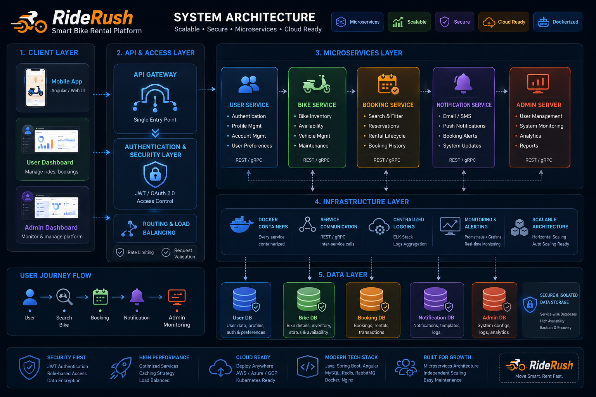

# 🏎️ RideRush: Smart BikeRental Microservices Platform

Welcome to **RideRush**, an enterprise-grade, highly scalable, and secure microservices platform designed for modern vehicle rental management. This organization hosts a decoupled ecosystem built using modern cloud-native patterns, robust security wrappers, and event-driven communication.

---

## 🏗️ System Architecture

Here is a high-level blueprint of the RideRush ecosystem. The entire platform is built with a **Security-First** mindset, ensuring strict isolation between the Client, API Gateway, Services, and Database layers.



---

## 🛠️ Tech Stack & Ecosystem Matrix

| Layer | Technologies | Core Engineering Purpose |
| :--- | :--- | :--- |
| **1. Client Layer** | Angular 16+, TypeScript, TailwindCSS | High-performance, reactive state-managed dashboards for Users and Admins. |
| **2. API & Access Layer** | Spring Cloud Gateway, WebFlux Security | Centralized CORS management, reactive token filtering, and edge-routing proxying. |
| **3. Microservices Layer** | Spring Boot 3.x, Java 17+, Spring Data JPA | Isolated domain microservices running business logic (User, Bike, Booking, Notification). |
| **4. Infrastructure Layer** | Apache Kafka, Docker, SpringDoc OpenAPI | Event-driven architecture, service containerization, and unified Swagger doc aggregation. |
| **5. Data Layer** | PostgreSQL / MySQL | Database-per-service pattern ensuring zero cross-service schema tightly-coupled dependencies. |

---

## 💡 Key Engineering Triumphs (What I Solved)

When reviewing this codebase, you will find implementations addressing critical distributed systems challenges:

### 🛡️ Decoupled "DRY" Shared Security Library
Instead of duplicating JWT filters and OAuth2 resource server configurations across every microservice, I engineered a standalone **Shared Security Library (`RideRush-Security-Shared`)**. Microservices simply import this module via Maven, dramatically reducing configuration boilerplate and enforcing enterprise-grade access control globally.

### 🔄 Dynamic OpenAPI/Swagger Aggregation through Gateway
Microservices in private networks naturally hide their API specs. I implemented a unified **Swagger UI Aggregator** inside the API Gateway. By configuring service-specific routing path prefixes (e.g., `/users`, `/bikes`) dynamically inside the shared OpenAPI definitions, developers and clients can interactively execute and test live JWT-authenticated requests directly through port `8080` without hitting CORS walls or 404 router dead-ends.

### ⚡ Reactive Edge Security Filtering
Using Spring WebFlux Security at the Gateway layer, pre-flight `OPTIONS` requests and structural auth endpoints are explicitly carved out of token-validation chains, neutralizing authentication race conditions prior to downstream microservice forwarding.

---

## 📂 Core Repositories in This Organization

* [**`api-gateway`**](https://github.com/RideRush/API-Gateway) – The reactive Spring Cloud entry point handling edge-routing, centralized CORS, and global security filters.
* [**`user-service`**](https://github.com/RideRush/User-Service) – Handles profile management, identity provider logic, and authentication endpoints.
* [**`bike-service`**](https://github.com/RideRush/Bike-Service) – Manages real-time inventory, vehicle availability metrics, and status tracking.
* [**`shared-security-library`**](https://github.com/RideRush/Security) – The custom reusable dependency providing uniform servlet and reactive security configurations.

---
## 🚀 Quick Start & Verification

### 1. Boot up the Ecosystem

Clone the root repository and start the containerized infrastructure stack:

```bash
docker-compose up -d
```

Verify that all services are running:

```bash
docker ps
```

---

## 🔍 Interactive API Testing via Swagger UI

Once all service containers are initialized and connected through the API Gateway, verify routing and test secured APIs directly from Swagger.

### 1. Open Swagger UI

Open your browser and navigate to:

```
http://localhost:8080/swagger-ui
```

---

### 2. Select a Microservice

From the service definition dropdown in the top-right corner, switch the active context to:

```text
User Service
```

---

### 3. Authenticate

Expand the authentication endpoints and execute:

```http
POST /api/v1/auth/login
```

Click **Try it out** and provide credentials.

Example:

```json
{
  "email": "demo@riderush.com",
  "password": "password"
}
```

Click **Execute**.

---

### 4. Copy Access Token

After receiving:

```http
200 OK
```

Copy:

```text
accessToken
```

---

### 5. Authorize Requests

Click **Authorize** at the top of Swagger UI.

Paste:

```text
Bearer <accessToken>
```

Click **Authorize** → **Close**

---

### 6. Test Protected APIs

You can now execute authenticated requests through the Gateway.

Examples:

```http
GET /api/v1/users/profile

GET /api/v1/bikes

POST /api/v1/bookings
```

---

### ✅ Result

* Centralized API testing
* JWT-secured requests
* Gateway-based routing
* No CORS issues
* Unified developer experience

